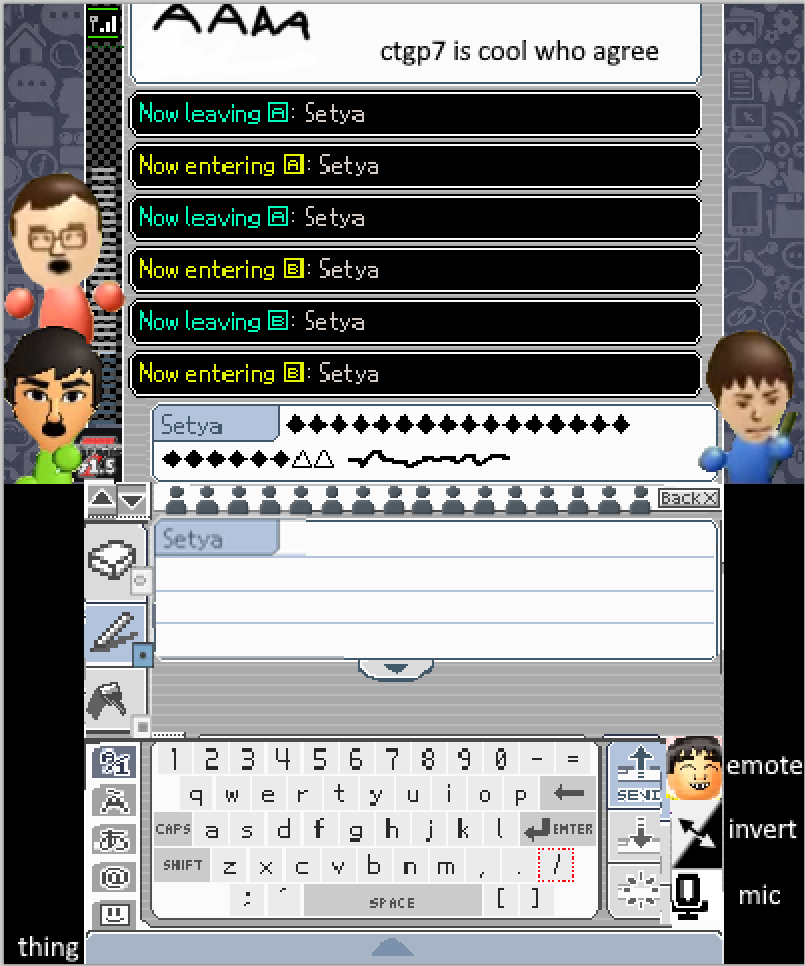
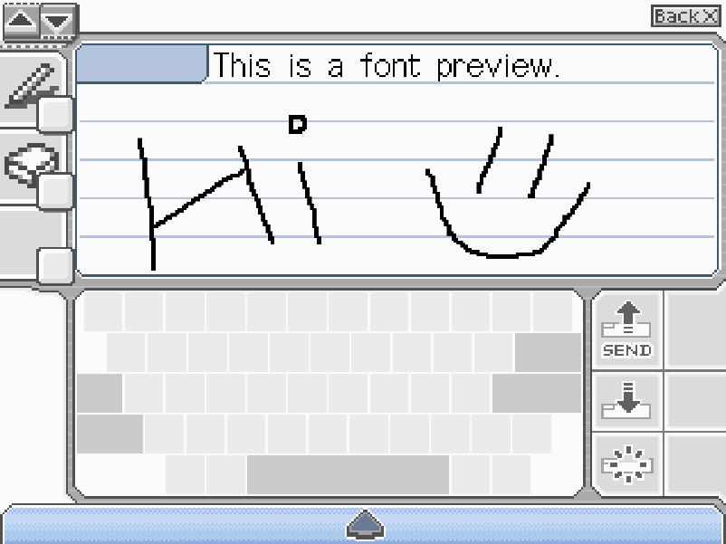

3 week WIP of a pictochat remake for the 3ds. typing and drawing exists, everything else not so.
Wanted to make this a big thing, ideas of miis appearing as you type (kinda like snapchat), and functionality where it could interact with the original DS Pictochat itself.

A chatting app on the 3ds was my ex-girlfriend's idea, who cheated sooo thats the end of this project's development.
Maybe the image editing functions I created are some use, a whole lot of pain there with the swizzles, uv cropping, rotated sprites, memory leaks I kept creating, all for this.

Included are two windows C repos (scrolling and compression examples). The compression one would take pixel data (1 nibble= 1px format) and compress it from like 15kb to under 1kb by switching between run length encoding sizes depending on what data lay ahead.
Wouldve implemented into the app eventually.

Hey if someone sees this and REALLY wants it who knows maybe someday. Wish things turned out different.

  
  

